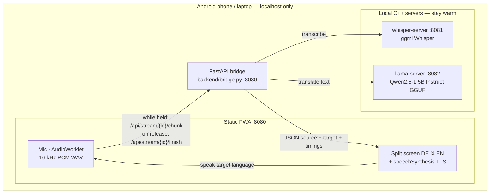

# Dragoman

**Offline German ↔ English speech translator** for face-to-face use at a
counter. Runs entirely on-device (Termux on Android, or a Linux laptop): no
cloud APIs after setup, no GPU required.

Built for warehouse / retail conversations where one person speaks German and
the other English. Pass the phone across the counter — the top half is rotated
for the other person.

[](LICENSE-MIT)
[](LICENSE-APACHE)

---

## Features

- Split-screen PWA: German side upside-down, English side right-side up
- Hold-to-talk → 16 kHz mono PCM WAV (AudioWorklet, not MediaRecorder)
- Streaming upload while the button is held (less wait after release)
- `de-en` / `en-de` with **one Whisper call** + small local LLM
- Offline browser TTS (`speechSynthesis`)
- Phrasebook for canned lines
- MIC TEST + `debug/last.wav` for audio debugging
- Per-stage timing in the UI: `whisper · llm · total`
- Tuned for mid-range ARM phones (e.g. Dimensity 7200, 8 GB RAM)

---

## Architecture



### Data flow

| Direction | Pipeline |
|-----------|----------|
| **DE → EN** | Whisper `transcribe(de)` → Llama “German → spoken English” |
| **EN → DE** | Whisper `transcribe(en)` → Llama “English → spoken German” |

```text
PWA ──stream chunks──► bridge.py ──1× whisper──► whisper-server
                              │
                              └──llm chat──────► llama-server
                              │
                              └──JSON + timings──► PWA ──TTS──► speaker
```

### Ports

| Service | Port |
|---------|------|
| PWA + FastAPI bridge | `8080` |
| whisper-server | `8081` |
| llama-server | `8082` |

---

## Stack

| Layer | Tech |
|-------|------|
| UI | HTML / CSS / vanilla JS PWA (no npm, no React) |
| Bridge | Python 3, FastAPI, Uvicorn, httpx |
| ASR | [whisper.cpp](https://github.com/ggerganov/whisper.cpp) |
| MT | [llama.cpp](https://github.com/ggerganov/llama.cpp) + Qwen2.5-1.5B-Instruct Q4_0 |
| Default ASR model | `ggml-base-q5_1.bin` (`WHISPER_AC=384`) |

**Intentionally not used:** PyTorch, CUDA, CTranslate2, onnxruntime, NumPy-heavy code, cloud APIs, CDN fonts.

---

## Quick start (laptop)

```bash
git clone https://github.com/<YOU>/Dragoman.git
cd Dragoman

python -m venv .venv
source .venv/bin/activate          # Windows: .venv\Scripts\activate
pip install -r backend/requirements.txt

chmod +x scripts/*.sh
./scripts/setup_models.sh          # ~1.3 GB, once (needs network)
./scripts/build_engines.sh         # builds whisper-server + llama-server into deps/

./scripts/run.sh
```

Open **http://127.0.0.1:8080/** — allow the microphone, try **MIC TEST**, then hold a PTT button.

---

## Phone setup (Termux)

Target example: Nothing Phone 2a (Dimensity 7200 Pro, 8 GB), aarch64.

### 1. Termux packages

Install Termux from **F-Droid** (not Play Store).

```bash
pkg update && pkg upgrade
pkg install git clang cmake make python ffmpeg curl wget termux-api
```

### 2. Clone and build

```bash
cd ~
git clone https://github.com/<YOU>/Dragoman.git
cd ~/Dragoman
chmod +x scripts/*.sh

./scripts/build_engines.sh
# Uses: cmake -DGGML_NATIVE=ON -DGGML_CPU_ARM_ARCH="armv8.6-a+dotprod+i8mm"
```

Do **not** build with `GGML_NATIVE=OFF` on the phone — that turns off DOTPROD / i8mm and hurts latency badly.

### 3. Python + models

```bash
python -m venv .venv
source .venv/bin/activate
pip install -r backend/requirements.txt
./scripts/setup_models.sh
```

### 4. Android permissions

- Termux → **Microphone** allowed  
- Offline TTS: install **German (de-DE)** and **English (US/UK)** voice data  
  (Settings → System → Languages → Text-to-speech)

### 5. Run

```bash
cd ~/Dragoman
source .venv/bin/activate
./scripts/run.sh
```

In Chrome on the phone: **http://127.0.0.1:8080/**  
Optional: Add to Home screen.

When `run.sh` starts, confirm logs show `DOTPROD=1` and `MATMUL_INT8=1`.

---

## Usage

| Control | Action |
|---------|--------|
| Hold **Halten · DE→EN** (top) | German speaks → English text + TTS |
| Hold **Hold · EN→DE** (bottom) | English speaks → German text + TTS |
| **MIC TEST** | 3 s local record / peak / playback (no Whisper) |
| **Phrases** | Speak saved lines without the mic |
| Status line | `whisper N · llm N · total N` (ms) |

Expect roughly **1–3 s** thinking on a tuned phone build; laptop times vary.

---

## Configuration

```bash
WHISPER_MODEL=models/ggml-base-q5_1.bin \
WHISPER_AC=384 \
WHISPER_THREADS=4 \
./scripts/run.sh
```

`run.sh` prints the exact whisper-server command and warns if a flag is unsupported.

Benchmark models × audio-ctx × thread pinning:

```bash
./scripts/bench.sh path/to/clip.wav
```

---

## Repository layout

```text
backend/bridge.py          FastAPI bridge + stream sessions
backend/requirements.txt
frontend/                  Static PWA (HTML/CSS/JS + worklet + SW)
scripts/setup_models.sh    Download Whisper + Qwen weights
scripts/build_engines.sh   Build whisper.cpp / llama.cpp
scripts/run.sh             Launch all three processes
scripts/bench.sh           Latency / quality grid
LICENSE-MIT
LICENSE-APACHE
NOTICE                     Dual-license + third-party notes
```

Gitignored (not in the repo): `models/`, `deps/`, `debug/`, `logs/`, `.venv/`, `*.bin`, `*.gguf`.

---

## API

| Endpoint | Purpose |
|----------|---------|
| `POST /api/stream/{id}/chunk` | Upload ~1 s WAV while PTT is held |
| `POST /api/stream/{id}/finish` | Assemble buffer + translate (`direction`) |
| `POST /api/translate` | Fallback: full WAV after release |
| `GET /api/health` | Upstream liveness |
| `GET /api/debug/last` | Last clip as WAV |

Skipped turns return `{ "skipped": true, "reason": "silent"|"blank"|"hallucination", ... }`.

---

## License

Dragoman application code is dual-licensed under **MIT** or **Apache License 2.0** —
see [LICENSE-MIT](LICENSE-MIT), [LICENSE-APACHE](LICENSE-APACHE), and [NOTICE](NOTICE).

Upstream engines and model weights retain their own licenses.
